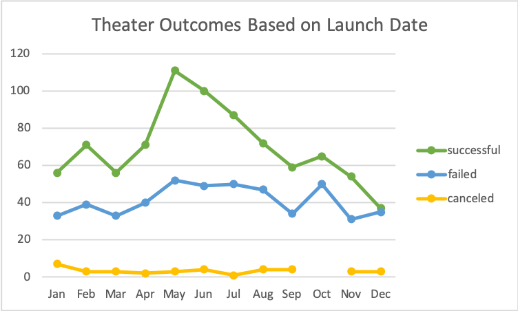
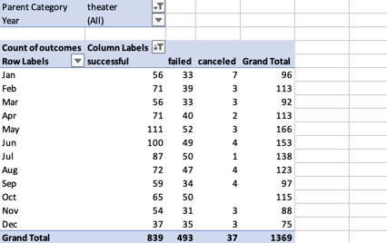
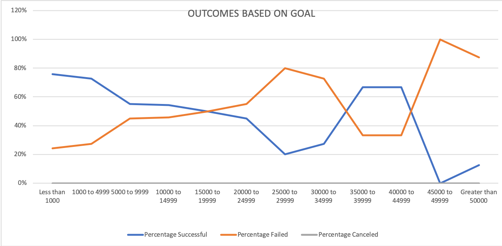
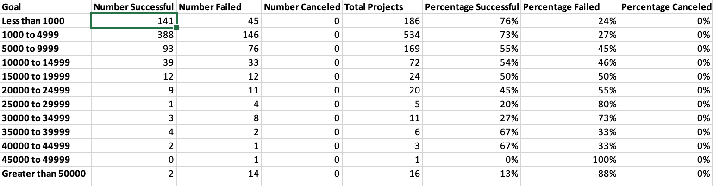

# Kickstarting with Excel

## Overview of Project

### Purpose
The purpose of my analysis was to analyze how close other campaigns came to their fundraising goals by their launch dates. 
## Analysis and Challenges

### Analysis of Outcomes Based on Launch Date

 
The line chart above titled "Theater Outcomes Based on Launch Date" displays the number of successful, failed, and canceled theater projects in each month of the year. I created this chart by first creating a pivot table. I filtered it by Parent Category and year. In the rows section, I put Date created conversion, which populated rows with the categories years, quarters, and date created conversion. I only kept the date created conversion in rows in order to display the months in the chart. In the columns and values sections, I included outcomes in order to present what campaigns succeeded or failed. Then I inserted a line chart using the insert tab and selecting line chart to better visualize how outcomes changed throughout the year. Refer below to see a visual for the table. 

### Analysis of Outcomes Based on Goals

The chart above titled "Outcomes Based on Goals" showcases the percentage of successful, failed, and canceled projects for different fundraising goal ranges. I created fundraising goal categories for the row labels to organize the outcomes and made columns for the number of successful, failed, and canceled, as well as the total and the percentages of each type of outcome. In order to calculate the number of successful, failed, and canceled play projects I used the COUNTIFS function to filter the data. In the formula I included commands to filter by the outcome type (successful/failed/canceled), the fundraising goal range, and by the subcategory "plays". In the formula I referenced this data from the Kickstarter worksheet. I then used these numbers to calculate the percentage of the total projects. To visualize this data I inserted a line chart to reflect the trend of outcomes in different fundraising goals.
 

### Challenges and Difficulties Encountered
When I was analyzing theater outcomes by launch date, I encountered some difficulties when showcasing the outcomes by month. Because I used the Date created conversion, the rows were initially filtered by years and not months. It took me some time to figure out that the rows section automatically populate with Quarters and years. I figured out you can move the years and quarters filters out of that section. 
Another Challenge I encountered occurred when I analyzed Outcomes based on goals. It was difficult for me to perfect the formula to filter by the proper goal ranges. I made the mistake of not referencing the Kickstart worksheet for both the first command for the range and the second.
## Results
- What are two conclusions you can draw about the Outcomes based on Launch Date?
In the cart we can see that the highest number of successful theater outcomes occur in the summer months May-August. However, there is also the highest number of failed outcomes. This could be due to these months having the highest total number of projects. Additionally, I see a decreasing trend in the number of successful outcomes after May. This may indicate that there are less successful projects later in the year. 
- What can you conclude about the Outcomes based on Goals?
A general trend that we can see is as fundraising goals increase, the percentage of successful projects decreases while the percentage of failed increases. There is an exception for projects with fundraising goals between $30000 and 45000. The reason for this is unclear, but perhaps there are some outliers in this range. For example, one large donor could make a difference in someone reaching their campaign goal. Additionally, in this range there are a smaller number of total projects meaning each individual campaign has more influence in how that group with similar fundraising goals would perform. i.e. There are 3 campaigns with a fundraising goal of 400000-450000. The individuals campaigns have more influence on the percentage figures. Additionally, the canceled number of projects is 0. This means that regardless of whether or not a campaign meets their goal, the project is not canceled. 
- What are some limitations of this dataset?
When looking at outcomes by date there is limited data for outcomes before 2014. Additionally, by looking at it by month rather than years we are not taking into account that months in different years may perform differently. May of one year could have performed immensely better than the other years and skewed the data to make it seem that it is the most successful month. - What are some other possible tables and/or graphs that we could create?
When looking at outcomes based on goals, a limitation is the ranges that we created. Greater than 50000 can encompass a greater range than the others that only span 5000. Additionally the thresholds we chose for these ranges could greatly effect the results. It can effect the total number of projects which could then potentially skew the data. 
- What are some other possible tables and/or graphs that we could create?
I think bar charts would have been better for both of these tables as neither are showing a continuous data set over time. If we had shown outcomes by date over by year a line chart would have made more sense. 
